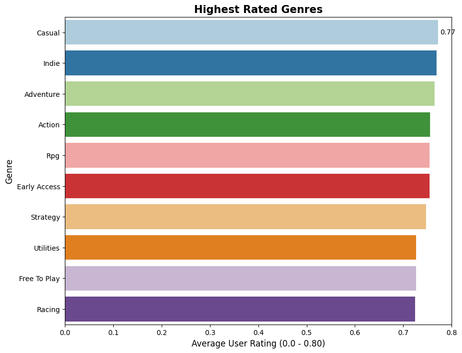
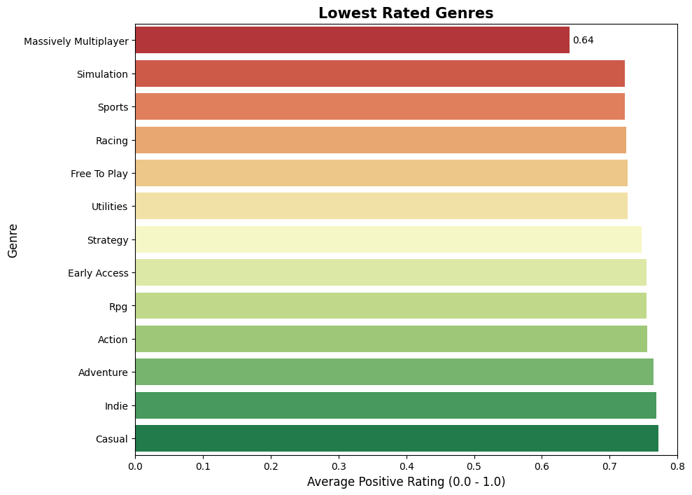

# Steam Games Market Analysis

### Project Overview

This project analyzes the Steam Games dataset from Kaggle to identify what drives video game success on the platform. By exploring genres, pricing models, and release timing, the analysis uncovers how these specific factors impact player engagement and estimated sales as of December 2025.

---

### Key Objectives
* Identify correlations between Genre and User Ratings.
* Identify the optimal price range that maximizes sales for Indie vs. AAA titles.
* Determine the most optimal month to release a game.

### Data Source
The dataset is created by Martin Bustos on Kaggle. Data is collected from both the API provided by Steam themselves and Steam Spy, a Steam stats service based on the Web API provided by Valve.
It covers games up until the release year of 2025.
[Steam Games Dataset on Kaggle](https://www.kaggle.com/datasets/fronkongames/steam-games-dataset/data)

---

### Insights

#### 1. Genre Performance

Figure 1: Highest and Lowest Rated Genres on Steam
These bar charts shows the ranking of both the highest and lowest rated genres judging from their average rating on Steam.
Genres such as Casual & Indie receive the highest average ratings from players on the platform.

* Casual and Indie games hold the **highest average ratings (0.77)**, driven by their easy-to-play, complete experiences.
* Massively Multiplayer (MMO) games are the **lowest-rated (0.64)**, heavily penalized by players for bugs, server problems, and long-term content droughts.
* Annualized Sports and Racing franchises **suffer from low ratings**, often review-bombed by players who feel the yearly releases lack meaningful updates.
* While the Action genre has the third-highest volume of releases, its lower average rating suggests the market is **flooded with lower-quality titles** that drag down overall player satisfaction.

#### 2. Optimal Pricing Strategy
* The $30–$60 tier is the optimal price point for both Indie and AAA studios, generating the **highest average estimated owners and average base revenue**.
* The vast majority of Indie games are priced under $10, yet this strategy yields the lowest base revenue. Indie developers who price their games in the $30–$60 range **earn nearly three times more on average than those charging $15–$30.**
* Pushing the price above $60 causes a sharp drop in sales volume, showing that expensive deluxe editions (or overpriced games) rarely make up for the lost buyers.
* Base revenue metrics do not account for in-game purchases or DLCs, which often supplement the income of cheaper or free-to-play titles.

#### 3. Strategic Release Timing
* Average sales volume **spikes from June through August**, aligning closely with the Steam Summer Sale.
* Mathematically, **August is the best month to launch**. It provides the **highest ratio of average owners per competitor**, allowing new releases to capture high player interest while facing the lowest number of competing launches.
* Developers must still weigh this advantage against real-time factors like major competitor release dates and current social media trends that may sway sales numbers unpredictably.

---

### Actionable Insights for Game Developers
* **Price Confidently:** If your game offers a complete, polished experience, price it in the $30–$60 range rather than underpricing it. The data shows players pay for perceived quality.
* **Prioritize Polish:** Releasing a bug-free, feature-complete game protects your user rating much better than releasing an unfinished live-service game with a roadmap.
* **Target Late Summer:** Aim for an August launch to capitalize on lingering Summer Sale traffic while avoiding the crowded AAA holiday release window in October and November.
* **Stand Out in Saturated Genres:** If developing an Action game, ensure you have a **strong secondary genre or unique mechanic** to cut through the high volume of competing daily releases.
